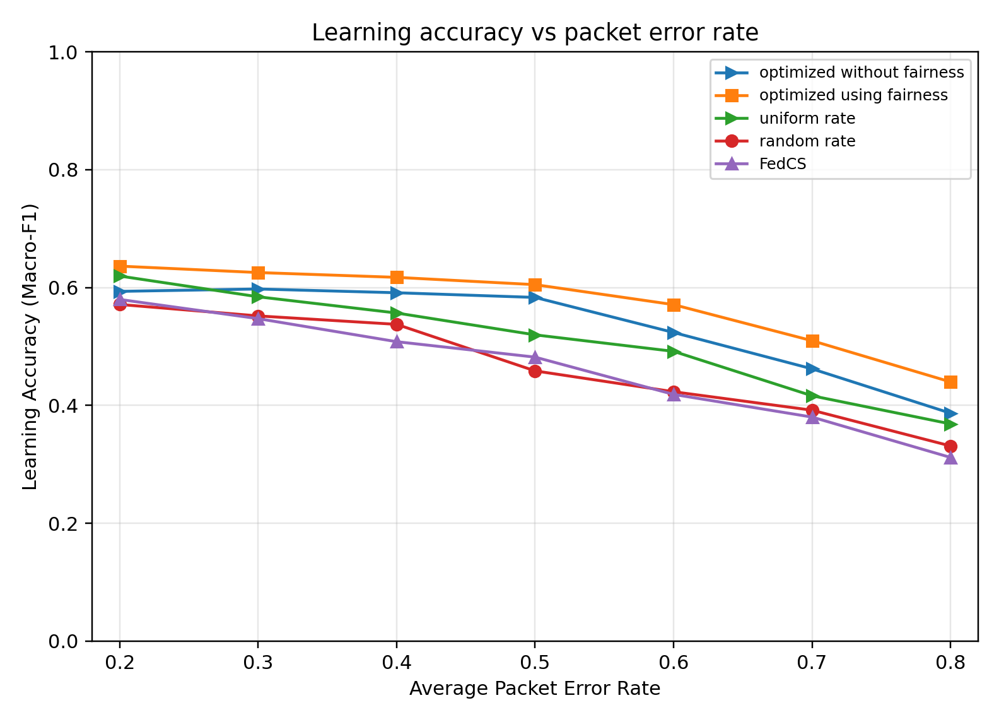
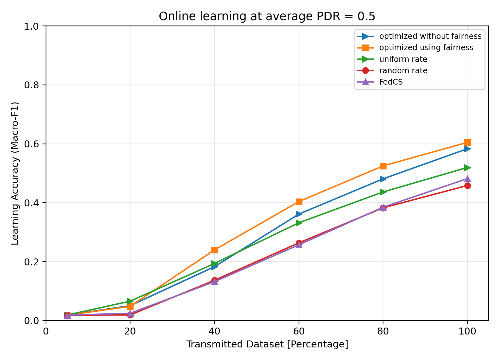

# Semantic-Aware RSU Scheduling on CIFAR-10

A small, readable reimplementation / robustness extension inspired by **“Diversity Maximized Scheduling in RoadSide Units for Traffic Monitoring Applications.”**
https://ieeexplore.ieee.org/abstract/document/10223373

The repository compares five scheduling policies under heterogeneous V2X packet loss:

- optimized without fairness
- optimized using fairness
- uniform rate
- random rate
- FedCS-style delay-only scheduling

## Main extension

The paper models heterogeneous packet drop using a Beta distribution. This repository additionally uses a **controlled heterogeneous PDR experiment** so that all ten RSUs have clearly different packet-drop rates in every interval.

For a requested average Packet Drop Rate (PDR) `p`, the code:

1. finds the widest symmetric range around `p` that stays inside `[0.001, 0.999]`;
2. uses 95% of that range;
3. creates 10 evenly separated PDR values;
4. randomly assigns those values to the 10 RSUs in every interval.

Therefore the average is exactly the requested value while the RSUs remain strongly heterogeneous.

Paper-inspired experiment:
heterogeneous communication + semantic scheduling

Additional robustness choices:
- 1–3 classes per RSU
- M = K = 3 resource-constrained setting
- controlled heterogeneous PDRs
- randomized scenarios across seeds

The assignment changes from interval to interval and from seed to seed.

## Scenario seed

One seed controls the complete experimental scenario:

- RSU class composition
- actual CIFAR-10 images assigned to RSUs
- delay history
- PDR assignment history
- packet success/failure events
- random-baseline coalitions

The CNN initialization uses a fixed seed for fair method-to-method comparison.

## Non-IID data

The paper uses exactly two classes per RSU in its unbalanced CIFAR-10 experiment. This robustness extension randomizes **1–3 classes per RSU**, while guaranteeing that all ten CIFAR-10 classes are represented somewhere in every scenario.

## Run

```bash
pip install -r requirements.txt
python experiment.py
```

## Results

Fairness-aware scheduling consistently achieved the highest
downstream CIFAR-10 F1 across the tested packet-error rates.



As more successfully transmitted samples became available,
the semantic-aware scheduler maintained the strongest final
learning performance.


